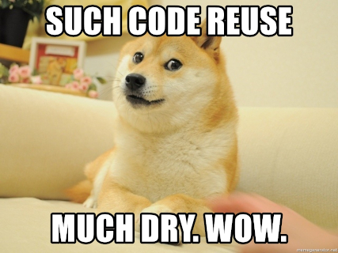

Optional and Named Parameters
-----------------------------


### An important software engineering motto

> Don't reinvent the wheel, or worse, a square wheel.


### Code reuse


Nope, not that one


### Libraries

* Writing a library means writing code that can be reused by others (your team or other people)
  - it's painful to have to rewrite the `print` function everytime we make a CLI app right?
  - reusable code is often flexible, to cater to the many possibilities of usage
  - look at `substring` from Dart (or your favorite programming language)
    
  ```dart
  "coronavirus".substring(6) == 'virus'
  "coronavirus".substring(0, 6) == 'corona'
  ```


### Optional parameters promote flexible and reusable code

* Most languages support this feature, in one way or another
  - Those that don't, probably support method overloading (e.g. Java)
  - Dart's syntax is a little unique, it uses square brackets to denote optionality
  - usually paired with default args to avoid `null` errors
* Say a dog usually barks once, but at times it does bark repeatedly


### What about...

- `void barkOnce()` and
- `void barkRepeatedly(int times)`?


### DRY = Don't Repeat Yourself

We'll revisit this very **important** principle next chapter (yeah inculcate important things to 
students through repetition 😊), but it's a good time to introduce this.




### Why repetitive?

Hard to appreciate if all we repeat is one line of code like `print('Arf!')` for `barkOnce()` and
`barkRepeatedly`.  But what if:

```dart
void barkOnce() {
  // complicated animation logic
  // play sound, depending on the dog's size and mood
  // while ensuring it's in-sync with the animation
}

void barkRepeatedly(int times) {
  for (var i = 0; i < times; i++) {
    // complicated animation logic
    // play sound, depending on the dog's size and mood
    // while ensuring it's in-sync with the animation
  }
}
```


### Making # of times optional

```dart [1-2 | 5-15 | 18-21]
// dog.dart
import 'dart:io'; // for stdout

class Dog {
  void bark([int times]) {
    if (times == null) {
      times = 1;
    }

    for (var i = 0; i < times; i++) {
      stdout.write('Arf! ');
    }

    print('');
  }
}

//main.dart
var dog = Dog();
dog.bark(); // Arf!
dog.bark(5); // Arf! Arf! Arf! Arf! Arf! 
```

Optional args that aren't provided are going to be null.


### Using default arguments

Shorter syntax, removes null-checking conditionals

```dart [5-11 | 14-17]
// dog.dart
import 'dart:io';

class Dog {
  void bark([int times = 1]) {
    for (var i = 0; i < times; i++) {
      stdout.write('Arf! ');
    }

    print('');
  }
}

//main.dart
var dog = Dog();
dog.bark(); // Arf!
dog.bark(5); // Arf! Arf! Arf! Arf! Arf! 
```


### Detour: pub.dev packages

* Let's get some help beautifying your equations for Problem Set 01b, Prob #4 (Line)
  - y = 2.0x + 3.0 is kinda ugly
  - luckily the `NumberFormat` class exists on pub.dev

```dart
import 'package:intl/intl.dart'; // NumberFormat is here

// thousands separator, round off to 2-places
// and NO trailing zeroes like 33.0
var formatter = NumberFormat('#,###.##');
print(formatter.format(5553456.789)); // prints 5,553,456.79

print(4 / 2); // prints 2.0, yuck!
print(formatter.format(4 / 2)); // prints 2

print(7 / 9);  // prints 0.7777777777777778
print(formatter.format(7 / 9)); // prints 0.78
```


### Create a `pubspec.yaml` file

It must be named **pubspec.yaml**, no other names

```yaml
# name must be a valid Dart identifier
name: oop_fundamentals  

environment:
  # means Dart version 2.x.x above 2.6.0
  sdk: '>=2.6.0 <3.0.0' 

dependencies:
  intl: ^0.16.1 # how do you know what to type here?
```


### Named Parameters

+ Positional parameters require us to give the required arguments in order
  - dog.eat(1, 'banana'); <span style="color: green">✔</span>
  - dog.eat('banana', 1); <span style="color: red">❌</span>
* Named parameters don't require such inhuman feats of memory
  - at times makes code more readable as well
  - use curlies `{` and `}` rather than square brackets

```dart [2-4]
class Dog {
  void eat({ int quantity, String food }) {
    print("Dog is eating $quantity unit(s) of $food.");
  }
}
```


### Providing args for named params

```dart
dog.eat(quantity: 1, food: 'banana');  // ✔ OK 
dog.eat(food: 'chimken', quantity: 5); // ✔ also OK

// Dog is eating 1 unit(s) of banana.
// Dog is eating 5 unit(s) of chimken.
```

<pre class="fragment">
  <code class="dart hljs" data-trim>
    dog.eat();
    dog.eat(quantity: 3);
    dog.eat(food: 'brocolli');

    // Dog is eating null unit(s) of null.
    // Dog is eating 3 unit(s) of null.
    // Dog is eating null unit(s) of brocolli.
  </code>
</pre>

uh oh! Named arguments are optional! 😱😱😱 <!-- .element class="fragment" -->


### Solution 01:  Default arguments, to the rescue again

```dart
class Dog {
  void eat({ int quantity = 1, String food = 'something' }) {
    print("Dog is eating $quantity unit(s) of $food.");
  }
}

// main.dart
dog.eat();
dog.eat(quantity: 3);
dog.eat(food: 'brocolli');

// Dog is eating 1 unit(s) of something.
// Dog is eating 3 unit(s) of something.
// Dog is eating 1 unit(s) of brocolli.
```

But what if I want required named params? <!-- .element class="fragment" -->


### Solution 02:  Use the `@required` annotation from the `meta` package

```yaml
dependencies:
  intl: ^0.16.1
  meta: ^1.2.2   # install the meta package from pub.dev
```

```dart [4-6 | 9-12 | 14-16]
import 'package:meta/meta.dart';

class Dog {
  void eat({ @required int quantity, @required String food }) {
    print("Dog is eating $quantity unit(s) of $food.");
  }
}

// main.dart
dog.eat();
dog.eat(quantity: 3);
dog.eat(food: 'brocolli');

// Dog is eating null unit(s) of null.
// Dog is eating 3 unit(s) of null.
// Dog is eating null unit(s) of brocolli.
```

Surprise!  It still runs! 😱😱😱  <!-- .element class="fragment" -->


### But you get a warning, be grateful!


* no compile errors, but you get a **linter** error.
  -  linter, is a tool that analyzes source code to flag programming errors, bugs, stylistic errors,
    and suspicious constructs. (-Wikipedia)


### Linters are standard tooling for software engineers

* So don't worry if `@required` named params are not part of Dart's core
  - if you forget to specify required named params, the linter will let you know
  - it can check for other stuff as well
* Pass this course, and you can take SE 2224 (Software Engineering Tools and Practices) first sem.
* We'll get to learn more about linters such `dartanalyzer`.
