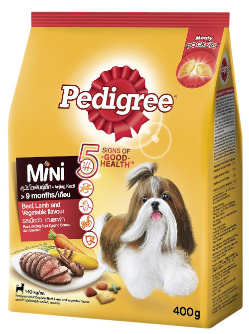

Parameters, Return Values, and Constructors
-------------------------------------------


#### You can give extra info to a single method rather than an entire class.

<div style="display: flex;">
  <div>
    
  </div>

  <pre class="dart" style="flex: 1; height: 225px; box-shadow: none; margin-top: 0px">
    <code data-trim>
      class Dog {
        String name;

        void eat(int quantity, String food) {
          print('$name is chewing...');
          print('$quantity unit(s) of $food');
        }        
      }
    </code>
  </pre>
</div>

`quantity` and `food` are the **parameters** of the eat method defined above ☝

```dart
tucker.eat(1, 'banana');   // 1 and 'banana' are arguments
girlDog.eat(5, 'chimken'); // supplied when calling `eat`
```


### Exercise

1.  Make a dog gain weight everytime he/she eats 3 or more units of any of the following:
    rice, pork, beef

2.  Modify the bark() method to accept an integer parameter indicating how many times a dog keeps
    on barking.  Add another boolean argument dictating if the bark is angry (ALLCAPS) or normal.

3.  Add a method to make a dog sit.  Add a parameter indicating a delay in seconds in obeying the
    `sit` command.  Simulate the delay with text.


#### You can make a method give back (return) some value to you

<div style="display: flex;">
  <div style="flex: 1">
    
  </div>

  <pre class="dart" style="flex: 1; height: 250px; box-shadow: none; margin-top: 0px">
    <code data-trim>
      class Dog {
        String weight;

        // you promised to give back a boolean
        bool isMini() {
          // this returns true or false 👍
          return weight <= 40;  
        }        
      }
    </code>
  </pre>
</div>

`bool` is the **return type** of the `isMini()` method in the above example ☝

```dart
var recommendedPetFood = dog.isMini() ? 'Mini' : 'Adult';
cuteDog.eat(5, 'Pedigree $recommendedPetFood');
```


#### Exercise

According to [this article from BBC](https://www.bbc.com/news/magazine-22479412), the first two 
years of a small dog’s life is roughly the same as 12.5 human years, while it’s 10.5 for a medium 
dog, and nine for large dogs.

Each additional year of the dog’s life is then multiplied by between 4.3 and 13.4 years, depending
on the breed, to find their human age.  You can find the list of breeds when clicking on the link
in these slides, either online or in the PDF.

<sub>
  <small>TIP: `ageInHumanYears` instance var, `String getSize()`, `int getAgeInDogYears()`</small>
</sub>


### Can a method do both?

<div style="font-size: 0.85em">
  Write a `fetch(int x, int y)` method that retrieves a random toy given the (x, y) coordinates.
  It must return a string indicating the name of the fetched toy.  The room is divided into 4
  quadrants, and each quadrant has 1-3 toys.  Example, a dog doing to (3, -1) would fetch any of 
  these:  ball, sock, slipper
</div>

<pre>
  phone       |  bottle      3
  food bowl   |  stick       2
  kunai       |              1
  ------------|------------- 0
              |  ball       -1
  bone        |  sock       -2
              |  slipper    -3
 -4 -3 -2 -1  0  1  2  3  4
</pre>


### Constructors

What's the output of this?

```dart
var cute = Dog();
cute.name = 'Fifi';
print('${cute.name} is a ${cute.weight} lb. ${cute.breed}');
```

 <!-- .element class="fragment" style="width: 400px; height: 225px" -->  

`Fifi is a null lb. null` <!-- .element class="fragment" -->


### Constructors

Forcing others to give your dog the complete details

```dart [5 | 7-16 | 18-20]
class Dog {
  String name; 
  String breed; 
  int weight; 
  String dominantColor = 'brown'; // default color

  // Constructors have the same syntax as defining methods
  // in most languages, using the class name.
  // Some exceptions are JS, PHP, Python, Ruby
  Dog(String name, String breed, int weight) {
    // when parameter name and instance var name
    // conflicts, qualify instance vars with `this`
    // `this` refers to "this dog object itself"
    this.name = name;
    this.breed = breed;
    this.weight = weight;

    // You can also add other code aside from
    // setting instance vars, like
    print('Congratz for the newborn $breed puppy.');
  }

  void bark() {
    print("${name} the ${dominantColor} dog, says: Arf!");
  }
}
```


### Default Constructors

If you don't write a constructor, many languages will automagically write one for you.
This is called the **default constructor**, and roughly looks like this:

```dart [2-4]
class Dog {
  Dog() {
    // yup just an empty constructor with no parameters
  }
}
```

That's why you can still _"construct"_ objects in your main function using `new Dog()` or `Dog()`


### Instantiating with non-default constructors

It's as easy as giving it the arguments it requires.

```dart [1-3 | 5-10]
var dog1 = Dog('Tucker Budzyn', 'Golden Retriever', 55);
print("LOOK: there's ${dog1.name} the ");
print('${dog1.dominantColor} ${dog1.breed}');

var dog2 = Dog('Maya Polar Bear', 'Samoyed', 60);
// constructor did not ask for a dominant color
// but the default is brown, and Maya is white
dog2.dominantColor = 'white';
print("LOOK: there's ${dog2.name} the ");
print('${dog2.dominantColor} ${dog2.breed}');
```