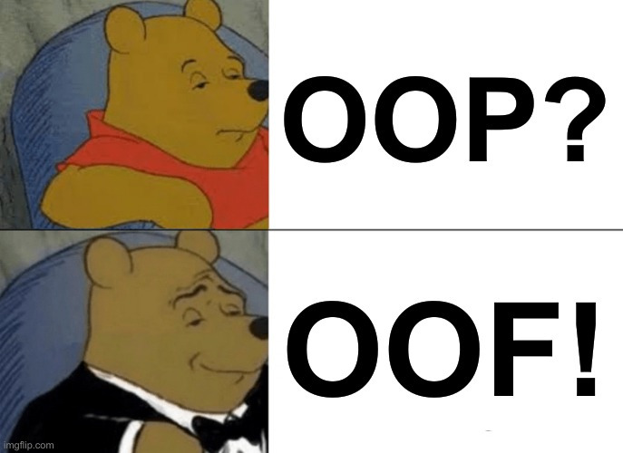
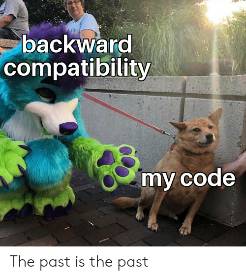

Member Visibility and Encapsulation
-----------------------------------

Say we have this dog class:

```dart
class Dog {
  int height;
}
```

And this in our `main` func:

```dart
  var dog = Dog();
  dog.height = 15;
```

Not bad right?


### Then a teammate misused our class

```dart
dog.height = 0; // what does a height of 0 mean for a dog?
```

<div style="display: flex">
  
  
</div>

Trying to represent a real-world object, but we ended up with an invalid one <!-- .element class="fragment" -->





### Encapsulation to the Rescue!

> The meaning of Encapsulation, is to make sure that "sensitive" data is hidden from users. 
  To achieve this, you must declare instance variables as private (cannot be accessed from 
  outside the class).  If you want others to read or modify the value of a private member, you can 
  provide public get and set methods. 
  <span style="font-size: 0.58em">
    (- from <a  href="https://www.w3schools.com/cpp/cpp_encapsulation.asp">W3Schools</a>)
  </span>


_Solution 01:_  The Java (and maybe standard [C++](https://www.w3schools.com/cpp/cpp_encapsulation.asp)) way

```dart [1-7 | 4]
// dog.dart

class Dog {
  int _height; // Step 1:  make instance vars private

  // _height is only accessbiel inside dog.dart
}
```

* In Dart, any instance var or method prefixed with an underscore is **private**.
* Other languages use the `private` keyword.  
* Some, likeJS and Python, use the _ prefix as a convention only (can't be enforced by the compiler).


### Solution 01, Step 1 Results

```dart
// main.dart

void main() {
  var dog = Dog();
  dog._height = 0;  // this will not compile!!!
}
```

- ☝ and our teammate can no longer give dogs invalid heights like zero, 
  no more **flat dogs**!! Victory!!

- Remember _height is only visible inside dog.dart.

<p class="fragment" style="font-size: 0.75em">
  Wait wat?  <code>dog._height = 5</code> is forbidden as well?
<p>


### Solution 01 continued...

```dart [1-14 | 6-13]
// dog.dart

class Dog {
  int _height; // Step 1:  make instance vars private

  // Step 2:  write a setter for _height
  void setHeight(int height) { 
    if (height > 0) { // do some checking
      _height = height;
    } else {
      _height = 1; // or print an Error message?
    }
  }
}
```

+ Setters are normally void methods, and accepts one parameter
  - that param is the proposed new value for the instance var.


### Solution 01 continued...

```dart [1-14 | 15-18]
// dog.dart

class Dog {
  int _height; // Step 1:  make instance vars private

  // Step 2:  write a setter for _height
  void setHeight(int height) { 
    if (height > 0) { // do some checking
      _height = height;
    } else {
      _height = 1; // or print an Error message?
    }
  }

  // Step 3:  write a getter for _height
  int getHeight() {
    return _height;
  }
}
```

+ Getters normally return a value, and accepts no parameters
  - it just returns the instance variable


### Solution 01 continued...

```dart
// main.dart
var dog = Dog();

dog.setHeight(0); // invalid height
// this should print "Dog's height is: 1"
print("Dog's height is: ${dog.getHeight()}");

dog.setHeight(50); // valid height
// this should print "Dog's height is: 50"
print("Dog's height is: ${dog.getHeight()}");

dog.setHeight(-999);
// this should print "Dog's height is: 1"
print("Dog's height is: ${dog.getHeight()}");
```

No more *flat dogs 🐕🐕🐕*!


### Solution 01 drawbacks

+ you can't start with public instance vars and change your mind later
  - you'll break your teammates' code
  - when you change `height` to `_height`, your teammates will see red squiggly lines on every
    instance of `dog.height = newHeight`
  - they now have to replace (better pray it's easy), every instance of `dog.height = newHeight`
    into `dog.setHeight(newHeight)` 😢😢😢😠😠😠😡😡😡
  - and every `print(dog.height)` into `print(dog.getHeight())`


### Solution 01 drawbacks, continued

<div style="display: flex">
  

  <ul style="flex: 1">
    <li>
      To make our code backwards-compatible
      <ul>
        <li>☝ i.e. teammate's OLD code works with your NEW code</li>
        <li>we always make our instance variables private</li>
        <li>and provide a setter/getter pair for each</li>
      </ul>
    </li>    
  </ul>
</div>


### Solution 01 drawbacks, continued

And classes won't do validation will usually look like:
<small>Fearing that change of mind later on.</small>

```dart [2-10 | 12-20]
class Dog {
  String _name;
  
  void setName(String name) {
    _name = name;
  }

  String getName() {
    return _name;
  }

  int _weight;

  void setWeight(int weight) {
    _weight = weight;
  }

  int getWeight() {
    return _weight;
  }
}
```


_Solution 02:_ The properties way

+ Many languages have a feature called **properties**. This allows us to start with public instance 
  vars, and change their mind later on.
+ The syntax of using setters and getters look like the syntax of using public vars.
+ This is called the [Uniform Access Principle](https://en.wikipedia.org/wiki/Uniform_access_principle)

```dart
// spot the difference

dog.height = 30;  // public var syntax
print("I'm ${dog.height} ft. tall"); // public var syntax

dog.height = 5; // setter
print("I'm ${dog.height} ft. tall"); // getter
```


_Solution 02:_ The properties way

```dart
// dog.dart

class Dog {
  int height;  // Step 1: start with a public var
}
```

```dart
// main.dart
var dog = Dog();
dog.height = 0;  // Step 1a: oh noes a flat doggo again!
```

 <!-- .element style="width: 300px; height: 250px" -->


### Solution 02 continued...

change your mind

```dart
// dog.dart
class Dog {
  int _height; // Step 2: make _height private

  // Step 3:  write a setter
  set height(int height) {
    _height = height > 0 ? height : 1;
  }

  // Step 4: write a getter
  get height { // note Dart has NO paren but JS has
    return _height;
  }
}
```


### Solution 02 continued...

```dart
// main.dart

var dog = Dog();
dog.height = 0;  // this code will not get any red squigglies
```

* but a public var will give our dog a height of 0
* whereas our setter will ensure that our dog gets at least a height of 1
* teammates' code didn't break, just changed behavior (e.g. changed output)
* Solution 02 has drawbacks though, to be fair to Java-style setters/getters


### Solution 02 drawback

```dart
var color = 'blue';
print("Of course it is $color!");

var apple = Apple();
apple.color = 'blue';
print("Of course it is a ${apple.color} apple!");
// prints "Of course it is a red apple."  NNNNAAAANNNNIII???

// opens apple.dart, ah color is a property
// the setter only accepts red/green
```

The main drawback is that setters have side-effects that are not obvious when quickly glancing 
at the code.  It can ambush people into nasty surprises.


### Which one to use

If properties are available in a language, they're the automatic and **idiomatic** choice.

> Idiomatic code is code that does a common task in the common way for your language.

Always strive to write code that is considered idiomatic for the language.


### Second purpose of getters:  computed properties

```dart [1-14 | 10-13 | 16-21]
// circle.dart
import 'dart:math';

class Circle {
  int radius;

  Circle(int radius) {
    this.radius = radius;
  }

  double get area {
    return pi * pow(radius, 2);
  }
}

// main.dart
var circle = Circle(5);
print('r = ${circle.radius}, A = ${circle.area}');

// you can't do this, area is only a getter, no setter
circle.area = 100; 
```